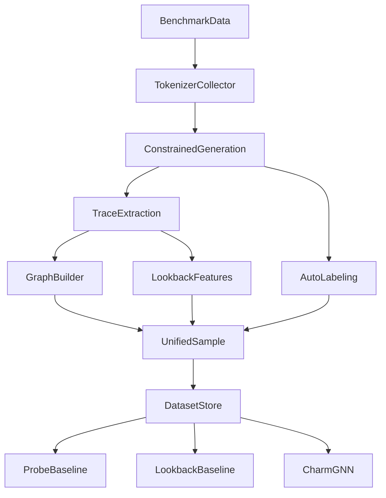

# Unified `tokenizer` Implementation Plan

## Objective

Implement the full merged system centered in `[/home/saksham/coding/GraphGuard/tokenizer]( /home/saksham/coding/GraphGuard/tokenizer )` so it can:

- load benchmark examples instead of relying only on terminal input
- generate constrained responses with Qwen using the existing grammar flow in `[/home/saksham/coding/GraphGuard/tokenizer/grammar.py]( /home/saksham/coding/GraphGuard/tokenizer/grammar.py )` and `[/home/saksham/coding/GraphGuard/tokenizer/main.py]( /home/saksham/coding/GraphGuard/tokenizer/main.py )`
- extract hidden-state nodes and sparse attention edges using the current hook logic in `[/home/saksham/coding/GraphGuard/tokenizer/extractor.py]( /home/saksham/coding/GraphGuard/tokenizer/extractor.py )`
- compute lookback-ratio features for context-grounded tasks using ideas from `[/home/saksham/coding/GraphGuard/Lookback-Lens/step01_extract_attns.py]( /home/saksham/coding/GraphGuard/Lookback-Lens/step01_extract_attns.py )`
- auto-label correctness using benchmark-answer logic inspired by `[/home/saksham/coding/GraphGuard/LLMsKnow/src/compute_correctness.py]( /home/saksham/coding/GraphGuard/LLMsKnow/src/compute_correctness.py )`
- save one canonical multimodal `.pt` sample per example
- train three comparable critics: probe baseline, lookback baseline, and CHARM-style GNN

## Target Architecture




## Phase 1: Refactor `tokenizer` Into Reusable Components

Create a proper package structure under `[/home/saksham/coding/GraphGuard/tokenizer]( /home/saksham/coding/GraphGuard/tokenizer )` and move responsibilities out of the current interactive script.

Primary changes:

- keep `[/home/saksham/coding/GraphGuard/tokenizer/main.py]( /home/saksham/coding/GraphGuard/tokenizer/main.py )` as a thin entrypoint only
- split current logic into reusable modules for generation, extraction, labeling, storage, and dataset loading
- preserve the existing Qwen loading path and current hook behavior as the initial base implementation

Initial module layout:

- `tokenizer/collectors/`
- `tokenizer/datasets/`
- `tokenizer/extractors/`
- `tokenizer/labels/`
- `tokenizer/storage/`
- `tokenizer/training/`
- `tokenizer/utils/`

Key code to preserve and relocate:

- current stop-tag and structured validation logic from `[/home/saksham/coding/GraphGuard/tokenizer/main.py]( /home/saksham/coding/GraphGuard/tokenizer/main.py )`
- current hook buffer and sparse-attention extraction from `[/home/saksham/coding/GraphGuard/tokenizer/extractor.py]( /home/saksham/coding/GraphGuard/tokenizer/extractor.py )`
- current graph serialization from `[/home/saksham/coding/GraphGuard/tokenizer/dataset_manager.py]( /home/saksham/coding/GraphGuard/tokenizer/dataset_manager.py )`

Essential behavior to preserve:

```1:30:/home/saksham/coding/GraphGuard/tokenizer/grammar.py
import outlines
from outlines.types import Regex
from transformers import AutoModelForCausalLM, AutoTokenizer

def build_generator(model_name="Qwen/Qwen3.5-0.8B"):
    ...
    regex_pattern = r"<think>\n[^<]+</think>\n<answer>\n[^<]+</answer>\n<confidence>\n(?:0\.\d+|1\.0)\n</confidence>"
```

## Phase 2: Add Unified Benchmark Dataset Adapters

Implement dataset loaders inside `tokenizer/datasets/` to consume benchmark examples directly, starting from the data already present in `[/home/saksham/coding/GraphGuard/LLMsKnow/data]( /home/saksham/coding/GraphGuard/LLMsKnow/data )`.

First-wave supported datasets:

- math from `AnswerableMath.csv` and `AnswerableMath_test.csv`
- natural questions from `nq_wc_dataset.csv`
- a context-grounded task from `Lookback-Lens/data` for lookback support

Implementation tasks:

- create a canonical dataset example object with fields like `task_type`, `prompt`, `context`, `gold_answer`, `dataset_name`, and `split`
- port only the dataset-loading ideas from `[/home/saksham/coding/GraphGuard/LLMsKnow/src/generate_model_answers.py]( /home/saksham/coding/GraphGuard/LLMsKnow/src/generate_model_answers.py )`
- avoid copying `wandb`, old output conventions, and one-off script orchestration from `LLMsKnow`
- support both benchmark mode and the existing interactive mode

## Phase 3: Build a Canonical Sample Schema

Replace the current “graph only” save format with one multimodal sample object that still contains a PyG graph but also stores labels, text, dense features, and metadata.

Implement under `tokenizer/storage/`:

- `schema.py` for the canonical sample contract
- `graph_builder.py` for converting hook buffers into PyG graph tensors
- `sample_writer.py` for atomic `.pt` saving and manifest updates

Canonical sample contents:

- text: prompt, context, gold answer, exact answer, model answer
- graph: `x`, `edge_index`, `edge_attr`
- signals: hidden states, sparse attention trace, lookback ratios, token scores, confidence
- labels: correctness, faithfulness, span labels, optional human label
- metadata: model, dataset, split, generation settings, source mode

Backwards compatibility:

- preserve the ability to emit the current PyG graph-only object during transition if needed
- migrate `[/home/saksham/coding/GraphGuard/tokenizer/dataset_manager.py]( /home/saksham/coding/GraphGuard/tokenizer/dataset_manager.py )` into the new storage layer rather than deleting the graph logic

## Phase 4: Add Automatic Correctness Labeling

Implement benchmark-aware correctness labeling under `tokenizer/labels/` using the matching logic from `[/home/saksham/coding/GraphGuard/LLMsKnow/src/compute_correctness.py]( /home/saksham/coding/GraphGuard/LLMsKnow/src/compute_correctness.py )` and exact-answer extraction ideas from `[/home/saksham/coding/GraphGuard/LLMsKnow/src/extract_exact_answer.py]( /home/saksham/coding/GraphGuard/LLMsKnow/src/extract_exact_answer.py )`.

Implementation scope:

- parse the text inside `<answer>`
- compare against the dataset gold answer
- store `y_correct`
- support task-specific labeling functions where needed
- keep label provenance so benchmark correctness is not confused with contextual faithfulness

Recommended output contract:

- `labels.correctness`
- `labels.correctness_source`
- `labels.exact_answer`
- `labels.exact_answer_valid`

## Phase 5: Add Lookback-Ratio Extraction

Extend the current hook system so context-grounded tasks can compute `Lookback-Lens` style attention ratios in addition to sparse graph edges.

Implementation tasks:

- add context-length tracking per sample
- compute attention-to-context vs attention-to-generated-token mass for each decode step
- save per-layer and per-head lookback ratios in the canonical sample
- keep this path optional for tasks without source context

Key reference behavior to reproduce conceptually:

```251:268:/home/saksham/coding/GraphGuard/Lookback-Lens/step01_extract_attns.py
for i in range(len(attentions)):
    for l in range(num_layers):
        attn_on_context = attentions[i][l][0, :, -1, :context_length].mean(-1)
        attn_on_new_tokens = attentions[i][l][0, :, -1, context_length:].mean(-1)
        lookback_ratio[l, :, i] = attn_on_context / (attn_on_context + attn_on_new_tokens)
```

Implementation note:

- this should live in `tokenizer/extractors/`, not be hardcoded into the collector loop
- preserve the current sparse-edge threshold path from `[/home/saksham/coding/GraphGuard/tokenizer/extractor.py]( /home/saksham/coding/GraphGuard/tokenizer/extractor.py )` while extending the buffer to capture ratio-ready information

## Phase 6: Add Faithfulness and Span-Level Labeling

Implement the second supervision tier for context-grounded tasks under `tokenizer/labels/`.

Scope:

- add a faithfulness labeler interface
- support an initial deterministic or heuristic faithfulness mode for local development
- optionally add a judge-backed annotation mode modeled after `[/home/saksham/coding/GraphGuard/Lookback-Lens/step02_eval_gpt4o.py]( /home/saksham/coding/GraphGuard/Lookback-Lens/step02_eval_gpt4o.py )`
- support span-level token masks for unsupported answer segments

Important design rule:

- keep these labels separate from correctness labels in the schema
- make the judge-backed path pluggable so the collector can still run without external API dependence

## Phase 7: Implement Collection Entry Points

Add proper CLI entrypoints so the system can run in both interactive and automatic benchmark modes.

Needed entrypoints:

- `collect_interactive.py`
- `collect_benchmark.py`
- `collect_context_tasks.py`

Behavior:

- load model once
- iterate dataset examples
- run constrained generation
- collect trace buffers
- compute labels
- save unified samples
- write a manifest for downstream training splits

The current interactive behavior in `[/home/saksham/coding/GraphGuard/tokenizer/main.py]( /home/saksham/coding/GraphGuard/tokenizer/main.py )` should become just one collector mode, not the whole system.

## Phase 8: Implement Baseline Training Scripts

Add training baselines under `tokenizer/training/` so the unified dataset immediately supports comparison experiments.

Required trainers:

- `train_probe_baseline.py`
  - hidden-state-only baseline inspired by `LLMsKnow`
- `train_lookback_baseline.py`
  - lookback-ratio-only baseline inspired by `Lookback-Lens`
- `train_gnn.py`
  - CHARM-style graph model over the sparse PyG graph

Each trainer should:

- load the same unified `.pt` dataset format
- support filtering by available label type
- train and evaluate on the same split definitions
- report directly comparable metrics

## Phase 9: Add a Fusion Critic and Ablation Support

After the three base paths work, implement an optional fused critic and ablation flags.

Targets:

- graph only
- hidden state only
- lookback only
- graph plus lookback
- graph plus lookback plus metadata

This phase proves whether the graph architecture adds value beyond the simpler baselines.

## Phase 10: Verification and Migration

Validate the full implementation incrementally.

Verification sequence:

1. benchmark sample loads correctly
2. constrained generation produces valid tagged output
3. hooks capture node activations and sparse edges
4. lookback ratios appear for context-grounded tasks
5. correctness labels are attached correctly
6. unified `.pt` sample can be read back
7. probe baseline trains on the stored data
8. lookback baseline trains on the stored data
9. GNN trains on the stored data

Migration cleanup:

- update docs in `[/home/saksham/coding/GraphGuard/COMBINED_TOKENIZER_APPROACH.md]( /home/saksham/coding/GraphGuard/COMBINED_TOKENIZER_APPROACH.md )` as code lands
- document the new collector and training commands
- retain old files only where they still serve as compatibility wrappers

## Risks and Design Constraints

- `outlines` integration is currently fragile, as seen from the existing runtime error around `outlines.generate`; the generator API should be stabilized early before deeper integration
- current attention extraction depends on hook output shape assumptions in `[/home/saksham/coding/GraphGuard/tokenizer/extractor.py]( /home/saksham/coding/GraphGuard/tokenizer/extractor.py )`; this should be validated across prompt-prefill and token-by-token decode
- correctness labels from `LLMsKnow` are not equivalent to contextual hallucination labels, so provenance must be explicit
- faithfulness and span labeling should not hard-depend on external judge APIs for core collection

## Implementation Order

1. stabilize generation and modularize current `tokenizer`
2. add canonical schema and graph-preserving storage
3. add benchmark dataset loading and correctness labels
4. add benchmark collector CLI
5. add lookback-ratio extraction for context tasks
6. add faithfulness and span labeling interfaces
7. add baseline trainers
8. add GNN trainer
9. add fusion and ablation support

## Expected Result

At the end of this implementation, `tokenizer` becomes a complete multimodal dataset factory and training stack:

- benchmark-driven instead of terminal-driven only
- graph-aware instead of graph-only
- multi-label instead of single-label
- comparable against strong hidden-state and lookback baselines
- ready for full CHARM-style critic training

